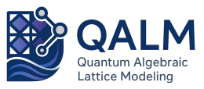

Quantum Algebra for Lattice Models and Applications (QALMA)
===========================================================

|

QALMA is a Python library for building and simulating many-body quantum
systems on lattices. It bridges the `ALPS <https://alpscore.org>`_ XML model
and lattice libraries with `QuTiP <https://qutip.org>`_, and provides its own
efficient algebraic representation of operators that exploits the tensor-product
structure of lattice Hamiltonians.

.. image:: https://github.com/QILPCM-IFLP-CONICET/QALMA/actions/workflows/ubuntu.yml/badge.svg
   :target: https://github.com/QILPCM-IFLP-CONICET/QALMA/actions/workflows/ubuntu.yml
   :alt: Tests

.. image:: https://github.com/QILPCM-IFLP-CONICET/QALMA/actions/workflows/check_documentation.yml/badge.svg
   :target: https://github.com/QILPCM-IFLP-CONICET/QALMA/actions/workflows/check_documentation.yml
   :alt: Docs

Features
--------

- **ALPS integration** — load models and lattice geometries directly from ALPS
  XML libraries (spin models, Hubbard, Heisenberg, custom models, chain /
  square / triangular lattices, and more).
- **Algebraic operator representation** — operators are stored as sums of
  local and few-body terms, not as full matrices. Memory and computation scale
  polynomially with system size instead of exponentially.
- **QuTiP interoperability** — any QALMA operator or state can be converted to
  a QuTiP ``Qobj`` with a single call, making the full QuTiP solver ecosystem
  immediately available.
- **MaxEnt projected evolution** — time-evolve density matrices projected onto
  a finite operator basis, enabling simulation of large systems beyond exact
  diagonalization.
- **Symbolic algebra** — operators support addition, multiplication,
  commutators, exponentiation, traces, and partial traces out of the box.

Installation
------------

Using pip directly from the GitHub repository::

    pip install git+https://github.com/QILPCM-IFLP-CONICET/QALMA/

For a clean setup it is recommended to use a virtual environment::

    python -m venv qalma_env
    source qalma_env/bin/activate          # macOS / Linux
    # .\qalma_env\Scripts\activate.bat     # Windows Command Prompt
    pip install git+https://github.com/QILPCM-IFLP-CONICET/QALMA/

Quick example
-------------

.. code-block:: python

    from qalma import build_system
    import numpy as np

    # Spin-1/2 Heisenberg chain with 4 sites (periodic boundary conditions)
    system = build_system()

    H  = system.global_operator("Hamiltonian")
    Sz = system.global_operator("Sz")

    # Algebraic manipulation — no explicit matrices needed
    Htotal = (H - 2 * Sz).simplify()

    print("Spectrum:", Htotal.eigenenergies())

    # Convert to QuTiP and evolve
    import qutip, numpy as np
    rho0 = (-Htotal).expm()
    rho0 = rho0 / rho0.tr()
    result = qutip.mesolve(
        H=Htotal.to_qutip(),
        rho0=rho0.to_qutip(),
        tlist=np.linspace(0, 10, 200),
        e_ops=[Sz.to_qutip()],
    )

See the ``docs/examples/`` notebooks for more complete walkthroughs.

Documentation
-------------

The documentation sources (user guide, API reference, examples) live in the
``docs/`` directory. To build them locally::

    pip install qalma[docs]
    cd docs
    make html

License
-------

QALMA is released under the `GNU General Public License Version 3 (GPL3) <LICENSE.txt>`_.

