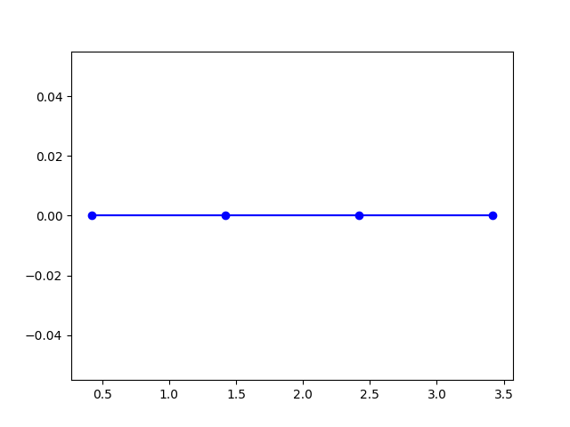
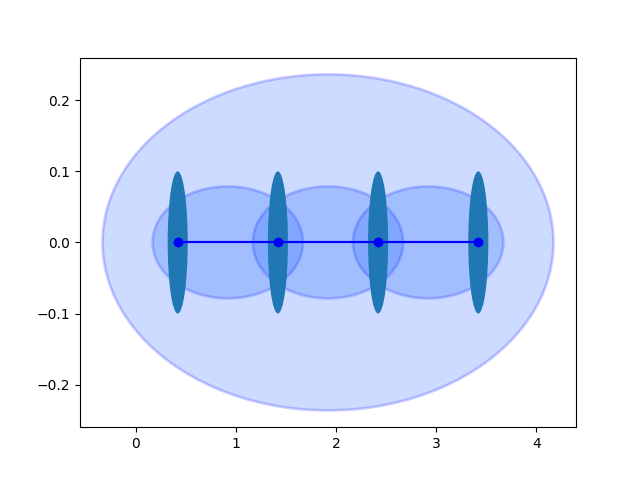
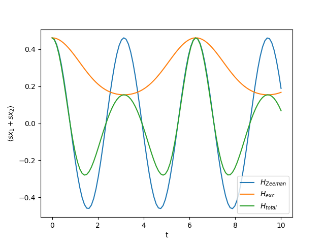

Quickstart
==========

This quickstart guide shows how to get started with alps2qutipplus: building a quantum system, exploring its structure, manipulating operators, and simulating quantum evolution.

Prerequisites
-------------
You should have installed `alps2qutipplus`, `matplotlib`, `numpy`, and `qutip`.

Importing Required Libraries
----------------------------

.. code-block:: python

    import matplotlib.pyplot as plt
    import numpy as np
    from qalma import build_system, model_from_alps_xml
    # Optional: list_models_in_alps_xml, list_geometries_in_alps_xml, graph_from_alps_xml

Building a Simple Quantum System
--------------------------------

To create a default system (a spin-1/2 chain with four sites), use:

.. code-block:: python

    system = build_system()

The system is described by a ``SystemDescriptor`` object, which contains information about the model, its geometry, and parameters.

Visualizing the Lattice
-----------------------

You can access the underlying graph and draw it:

.. code-block:: python

    system.spec["graph"].draw(plt)
    plt.show()

Output::
    graph:

    
Exploring Sites and Local Properties
------------------------------------

Each site is described in the ``system.sites`` dictionary:

.. code-block:: python

    print(system.sites.keys())  # Lists all site names

    # Explore the first site's properties:
    site = system.sites['1[0]']
    print("The diimension of the first site is ", site["dimension"])
    print("Quantum numbers:", site["qn"])
    print("Operators:", tuple(site["operators"]))

Output::

    dict_keys(['1[0]', '1[1]', '1[2]', '1[3]'])
    the dimension of the first site is  2
    Quantum numbers: {'S': {'min': 0.5, 'max': 0.5, 'fermionic': False, 'operator': 's'}, 'Sz': {'min': '-S', 'max': 'S', 'fermionic': False, 'operator': 'Sz'}}
    Operators: ('identity', 'Splus', 'Sminus', 'Sz', 's', 'Sx', 'Sy')
    

Working with Operators
----------------------

Global operators (like the Hamiltonian and magnetization) are readily available:

.. code-block:: python

    H = system.global_operator("Hamiltonian")
    print(H)

.. math::
 
   \left(\begin{array}{cc}0 & 0 & 0 & 0\\0 & 0 & 0 & 0\\0 & 0 & 0 & 0\\0 & 0 & 0 & 0\end{array}\right)_{1[0],1[1]} + \left(\begin{array}{cc}0 & 0 & 0 & 0 & 0 & 0 & 0 & 0\\0 & 0 & 0 & 0 & 0 & 0 & 0 & 0\\0 & 0 & 0 & 0 & 0 & 0 & 0 & 0\\0 & 0 & 0 & 0 & 0 & 0 & 0 & 0\\0 & 0 & 0 & 0 & 0 & 0 & 0 & 0\\0 & 0 & 0 & 0 & 0 & 0 & 0 & 0\\0 & 0 & 0 & 0 & 0 & 0 & 0 & 0\\0 & 0 & 0 & 0 & 0 & 0 & 0 & 0\end{array}\right)_{1[0],1[1],1[2]} + \left(\begin{array}{cc}0 & 0 & 0 & 0 & 0 & 0 & 0 & 0\\0 & 0 & 0 & 0 & 0 & 0 & 0 & 0\\0 & 0 & 0 & 0 & 0 & 0 & 0 & 0\\0 & 0 & 0 & 0 & 0 & 0 & 0 & 0\\0 & 0 & 0 & 0 & 0 & 0 & 0 & 0\\0 & 0 & 0 & 0 & 0 & 0 & 0 & 0\\0 & 0 & 0 & 0 & 0 & 0 & 0 & 0\\0 & 0 & 0 & 0 & 0 & 0 & 0 & 0\end{array}\right)_{1[0],1[1],1[3]} + \ldots (9794 terms) \ldots + \left(\begin{array}{cc}0 & 0 & 0 & 0 & 0 & 0 & 0 & 0\\0 & 0 & 0 & 0 & 0 & 0 & 0 & 0\\0 & 0 & 0 & 0 & 0 & 0 & 0 & 0\\0 & 0 & 0 & 0 & 0 & 0 & 0 & 0\\0 & 0 & 0 & 0 & 0 & 0 & 0 & 0\\0 & 0 & 0 & 0 & 0 & 0 & 0 & 0\\0 & 0 & 0 & 0 & 0 & 0 & 0 & 0\\0 & 0 & 0 & 0 & 0 & 0 & 0 & 0\end{array}\right)_{1[0],1[95],1[99]} + \left(\begin{array}{cc}0 & 0 & 0 & 0 & 0 & 0 & 0 & 0\\0 & 0 & 0 & 0 & 0 & 0 & 0 & 0\\0 & 0 & 0 & 0 & 0 & 0 & 0 & 0\\0 & 0 & 0 & 0 & 0 & 0 & 0 & 0\\0 & 0 & 0 & 0 & 0 & 0 & 0 & 0\\0 & 0 & 0 & 0 & 0 & 0 & 0 & 0\\0 & 0 & 0 & 0 & 0 & 0 & 0 & 0\\0 & 0 & 0 & 0 & 0 & 0 & 0 & 0\end{array}\right)_{1[0],1[96],1[99]} + \left(\begin{array}{cc}0 & 0 & 0 & 0 & 0 & 0 & 0 & 0\\0 & 0 & 0 & 0 & 0 & 0 & 0 & 0\\0 & 0 & 0 & 0 & 0 & 0 & 0 & 0\\0 & 0 & 0 & 0 & 0 & 0 & 0 & 0\\0 & 0 & 0 & 0 & 0 & 0 & 0 & 0\\0 & 0 & 0 & 0 & 0 & 0 & 0 & 0\\0 & 0 & 0 & 0 & 0 & 0 & 0 & 0\\0 & 0 & 0 & 0 & 0 & 0 & 0 & 0\end{array}\right)_{1[0],1[97],1[99]}

.. code-block:: python

    Sz = system.global_operator("Sz")
    print(Sz)

.. math::

   \left(\begin{array}{cc}-0.500 & 0\\0 & 0.500\end{array}\right)_{1[0]} + \left(\begin{array}{cc}-0.500 & 0\\0 & 0.500\end{array}\right)_{1[1]} + \left(\begin{array}{cc}-0.500 & 0\\0 & 0.500\end{array}\right)_{1[2]} + \left(\begin{array}{cc}-0.500 & 0\\0 & 0.500\end{array}\right)_{1[3]}

Or a local operator acting on an specific site:
   
.. code-block:: python

    Sx1 = system.site_operator("Sx@1[0]")
    print(Sx1)

.. math::

   \left(\begin{array}{cc}0 & 0.500\\0.500 & 0\end{array}\right)_{1[0]}
   
You can view the list of predefined global operators:

.. code-block:: python

    print(tuple(system.operators["global_operators"]))

Output::

   ('Sz', 'loop_term', 'spin_exchange_energy', 'Hamiltonian')

Operators can be combined algebraically:

.. code-block:: python

    Hzeeman = -2 * Sz
    Htotal = (Hzeeman + H).simplify()
    print(Htotal)

.. math::

   \left(\begin{array}{cc}0.250 & 0 & 0 & 0\\0 & -0.250 & 0.500 & 0\\0 & 0.500 & -0.250 & 0\\0 & 0 & 0 & 0.250\end{array}\right)_{1[0],1[1]} + \left(\begin{array}{cc}0.250 & 0 & 0 & 0\\0 & -0.250 & 0.500 & 0\\0 & 0.500 & -0.250 & 0\\0 & 0 & 0 & 0.250\end{array}\right)_{1[1],1[2]} + \left(\begin{array}{cc}0.250 & 0 & 0 & 0\\0 & -0.250 & 0.500 & 0\\0 & 0.500 & -0.250 & 0\\0 & 0 & 0 & 0.250\end{array}\right)_{1[2],1[3]} + \left(\begin{array}{cc}0.250 & 0 & 0 & 0\\0 & -0.250 & 0.500 & 0\\0 & 0.500 & -0.250 & 0\\0 & 0 & 0 & 0.250\end{array}\right)_{1[0],1[3]} + \left(\begin{array}{cc}1 & 0\\0 & -1\end{array}\right)_{1[0]} + \left(\begin{array}{cc}1 & 0\\0 & -1\end{array}\right)_{1[1]} + \left(\begin{array}{cc}1 & 0\\0 & -1\end{array}\right)_{1[2]} + \left(\begin{array}{cc}1 & 0\\0 & -1\end{array}\right)_{1[3]}
    
Analyzing Operators
-------------------

You can compute eigenvalues, exponentiate, or take the trace of operators:

.. code-block:: python

    print("Energies:", Htotal.eigenenergies())      # Spectrum

Output::
   Energies: array([-3.00000000e+00, -3.00000000e+00, -2.00000000e+00, -2.00000000e+00,
       -2.00000000e+00, -1.00000000e+00, -1.00000000e+00, -1.22220204e-16,
        5.77179330e-18,  5.66309413e-16,  1.00000000e+00,  1.00000000e+00,
        2.00000000e+00,  2.00000000e+00,  3.00000000e+00,  5.00000000e+00])

.. code-block:: python

    print("Exp(H)=\n",Htotal.expm())               # Exponential

Output::
   Exp(H)=
.. math::
   \left(\begin{array}{cc}0.250 & 0 & 0 & 0\\0 & -0.250 & 0.500 & 0\\0 & 0.500 & -0.250 & 0\\0 & 0 & 0 & 0.250\end{array}\right)_{1[0],1[1]} + \left(\begin{array}{cc}0.250 & 0 & 0 & 0\\0 & -0.250 & 0.500 & 0\\0 & 0.500 & -0.250 & 0\\0 & 0 & 0 & 0.250\end{array}\right)_{1[1],1[2]} + \left(\begin{array}{cc}0.250 & 0 & 0 & 0\\0 & -0.250 & 0.500 & 0\\0 & 0.500 & -0.250 & 0\\0 & 0 & 0 & 0.250\end{array}\right)_{1[2],1[3]} + \left(\begin{array}{cc}0.250 & 0 & 0 & 0\\0 & -0.250 & 0.500 & 0\\0 & 0.500 & -0.250 & 0\\0 & 0 & 0 & 0.250\end{array}\right)_{1[0],1[3]} + \left(\begin{array}{cc}1 & 0\\0 & -1\end{array}\right)_{1[0]} + \left(\begin{array}{cc}1 & 0\\0 & -1\end{array}\right)_{1[1]} + \left(\begin{array}{cc}1 & 0\\0 & -1\end{array}\right)_{1[2]} + \left(\begin{array}{cc}1 & 0\\0 & -1\end{array}\right)_{1[3]}

.. code-block:: python

   print("The partition function is ", (-Htotal).expm().tr(),"~", sum([np.exp(-en) for en in Htotal.eigenenergies()]))
   
Output::
   The partition function is  71.83776026426847 ~ 71.83776026426845
    

    
Visualizing Operator Support
----------------------------

To see which sites an operator acts on, use:

.. code-block:: python

    from qalma.utils import draw_operator
    fig, ax = plt.subplots()
    draw_operator(Htotal, ax)
    Htotal.system.spec["graph"].draw(ax)
    plt.show()

Qutip Integration and Time Evolution
------------------------------------

Operators can be converted to qutip objects and used in qutip solvers:

.. code-block:: python

    import qutip

    sx01 = system.site_operator("Sx@1[0]") + system.site_operator("Sx@1[1]")
    rho0 = sx01.expm()
    rho0 = rho0 / rho0.tr()
    ts = np.linspace(0, 10, 100)

    result = qutip.mesolve(
        H=Hzeeman.to_qutip(),
        rho0=rho0.to_qutip(),
        tlist=ts,
        e_ops=(sx01.to_qutip(),)
    )
    plt.plot(ts, result.expect[0], label="$H_{Zeeman}$")

    result = qutip.mesolve(
        H=H.to_qutip(),
        rho0=rho0.to_qutip(),
        tlist=ts,
        e_ops=(sx01.to_qutip(),)
    )
    plt.plot(ts, result.expect[0], label="$H_{exc}$")

    result = qutip.mesolve(
        H=Htotal.to_qutip(),
        rho0=rho0.to_qutip(),
        tlist=ts,
        e_ops=(sx01.to_qutip(),)
    )
    plt.plot(ts, result.expect[0], label="$H_{total}$")

    plt.legend()
    plt.xlabel("t")
    plt.ylabel(r"$\langle sx_1+sx_2\rangle$")
    plt.show()

Larger Systems
--------------

As long as explicit diagonalization or operations requiring the matrix representation of large objects are avoided, it is possible to define and manipulate larger quantum systems using the same methods.

.. code-block:: python

    large_system = build_system(100)  # Adjust parameters for larger systems as needed
    sz=system_large.global_operator("Sz")
    H = system_large.global_operator("Hamiltonian") + sz

    sx0_loc=system_large.site_operator("Sx@1[0]")
    comm = (H*sx0_loc-sx0_loc*H).simplify()
    comm

.. math::

   \left(\begin{array}{cc}0 & -0.250 & 0.250 & 0\\0.250 & 0 & 0 & -0.250\\-0.250 & 0 & 0 & 0.250\\0 & 0.250 & -0.250 & 0\end{array}\right)_{1[0],1[1]} + \left(\begin{array}{cc}0 & -0.250 & 0.250 & 0\\0.250 & 0 & 0 & -0.250\\-0.250 & 0 & 0 & 0.250\\0 & 0.250 & -0.250 & 0\end{array}\right)_{1[0],1[99]} + \left(\begin{array}{cc}0 & -0.500\\0.500 & 0\end{array}\right)_{1[0]}
